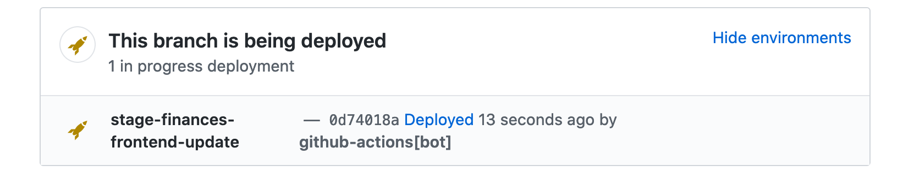
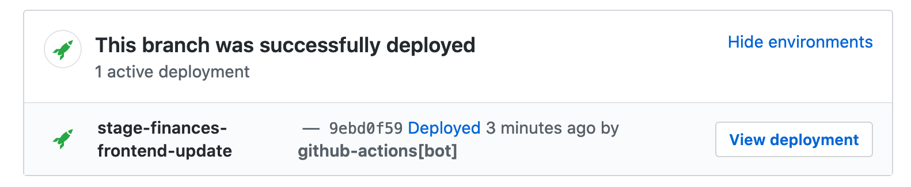
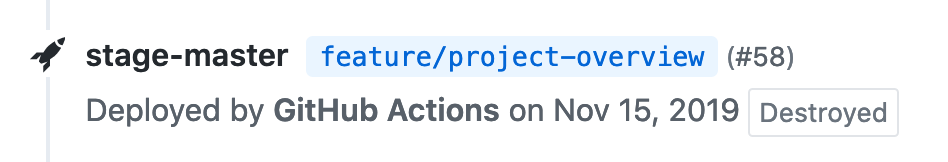

# GitHub Deployments [](https://bobheadxi.dev/r/deployments/) [](https://github.com/bobheadxi/deployments/actions/workflows/pipeline.yaml)

`bobheadxi/deployments` is a [GitHub Action](https://github.com/features/actions) for working painlessly with [GitHub deployment statuses](https://docs.github.com/en/rest/reference/deployments).
Instead of exposing convoluted Action configuration that mirrors that of the [GitHub API](https://developer.github.com/v3/repos/deployments/) like some of the other available Actions do, this Action simply exposes a number of configurable, easy-to-use "steps" common to most deployment lifecycles.

> 📢 This project is in need of additional maintainers - if you are interested in helping out please [let me know](https://github.com/bobheadxi/deployments/discussions/103)!

- [Configuration](#configuration)
  - [`step: start`](#step-start)
  - [`step: finish`](#step-finish)
  - [`step: deactivate-env`](#step-deactivate-env)
  - [`step: delete-env`](#step-delete-env)
- [Debugging](#debugging)
- [Migrating to v1](#migrating-to-v1)

A simple example:

```yml
on:
  push:
    branches:
    - main

jobs:
  deploy:
    runs-on: ubuntu-latest
    steps:
    - name: start deployment
      uses: bobheadxi/deployments@v1
      id: deployment
      with:
        step: start
        token: ${{ secrets.GITHUB_TOKEN }}
        env: release

    - name: do my deploy
      # ...

    - name: update deployment status
      uses: bobheadxi/deployments@v1
      if: always()
      with:
        step: finish
        token: ${{ secrets.GITHUB_TOKEN }}
        status: ${{ job.status }}
        env: ${{ steps.deployment.outputs.env }}
        deployment_id: ${{ steps.deployment.outputs.deployment_id }}
```

You can also refer to other projects that also use this action - you can find [more usages of this action on Sourcegraph](https://sourcegraph.com/search?q=context:global+uses:+bobheadxi/deployments%40.*+file:%5E%5C.github/workflows+-repo:bobheadxi+count:all&patternType=regexp), or check out the following examples:

- [`github/super-linter`](https://sourcegraph.com/search?q=context:global+repo:%5Egithub%5C.com/github/super-linter%24+file:%5E%5C.github/workflows+bobheadxi/deployments&patternType=literal) [](https://github.com/github/super-linter) - [GitHub's all-in-one linter Action](https://github.blog/2020-06-18-introducing-github-super-linter-one-linter-to-rule-them-all/)
- [`mxcl/PromiseKit`](https://sourcegraph.com/search?q=context:global+repo:%5Egithub%5C.com/mxcl/PromiseKit%24+file:%5E%5C.github/workflows+bobheadxi/deployments&patternType=literal) [](https://github.com/mxcl/PromiseKit) - promises for Swift and Objective-C
- [`saleor/saleor`](https://sourcegraph.com/search?q=repo:%5Egithub%5C.com/saleor/saleor%24+bobheadxi/deployments\&patternType=literal) [](https://github.com/saleor/saleor) - modular, high performance, headless e-commerce storefront
- [`sharetribe/sharetribe`](https://sourcegraph.com/search?q=context:global+repo:%5Egithub%5C.com/sharetribe/sharetribe%24+file:%5E%5C.github/workflows+bobheadxi/deployments&patternType=literal) [](https://github.com/sharetribe/sharetribe) - marketplace software
- [`skylines-project/skylines`](https://sourcegraph.com/search?q=repo:%5Egithub%5C.com/skylines-project/skylines%24+bobheadxi/deployments\&patternType=literal) [](https://github.com/skylines-project/skylines) - live tracking, flight database and competition web platform

Also feel free to chime in on the [show and tell discussion](https://github.com/bobheadxi/deployments/discussions/84) to share your usages of this Action!

Check out [this blog post](https://dev.to/bobheadxi/branch-previews-with-google-app-engine-and-github-actions-3pco) for a bit of background on the origins of this project.

## Configuration

The following [`inputs`](https://help.github.com/en/articles/workflow-syntax-for-github-actions#jobsjob_idstepswith) configuration options are for *all steps*:

| Variable     | Default                      | Purpose                                                                                                                                |
| ------------ | ---------------------------- | -------------------------------------------------------------------------------------------------------------------------------------- |
| `step`       |                              | One of [`start`](#step-start), [`finish`](#step-finish), [`deactivate-env`](#step-deactivate-env), or [`delete-env`](#step-delete-env) |
| `token`      |                              | provide your `${{ secrets.GITHUB_TOKEN }}` for API access                                                                              |
| `env`        |                              | identifier for environment to deploy to (e.g. `staging`, `prod`, `main`)                                                               |
| `repository` | Current repository           | target a specific repository for updates, e.g. `owner/repo`                                                                            |
| `logs`       | URL to GitHub commit checks  | URL of your deployment logs                                                                                                            |
| `desc`       | GitHub-generated description | description for this deployment                                                                                                        |
| `ref`        | `github.ref`                 | Specify a particular git ref to use,  (e.g. `${{ github.head_ref }}`)                                                                  |

### `step: start`

This is best used on the `push: { branches: [ ... ] }` event, but you can also have `release: { types: [ published ] }` trigger this event.
`start` should be followed by whatever deployment tasks you want to do, and it creates and marks a deployment as "started":



In addition to the [core configuration](#configuration), the following [`inputs`](https://help.github.com/en/articles/workflow-syntax-for-github-actions#jobsjob_idstepswith) are available:

| Variable        | Default | Purpose                                                                                             |
| --------------- | ------- | --------------------------------------------------------------------------------------------------- |
| `deployment_id` |         | Use an existing deployment instead of creating a new one (e.g. `${{ github.event.deployment.id }}`) |
| `override`      | `false` | whether to mark existing deployments of this environment as inactive                                |
| `payload`       |         | JSON-formatted dictionary with extra information about the deployment                               |

The following [`outputs`](https://help.github.com/en/actions/automating-your-workflow-with-github-actions/contexts-and-expression-syntax-for-github-actions#steps-context) are available:

| Variable        | Purpose                                |
| --------------- | -------------------------------------- |
| `deployment_id` | ID of created GitHub deployment        |
| `status_id`     | ID of created GitHub deployment status |
| `env`           | name of configured environment         |

<details>
<summary>Simple Push Example</summary>
<p>

```yml
on:
  push:
    branches:
    - main

jobs:
  deploy:
    steps:
    - name: start deployment
      uses: bobheadxi/deployments@v1
      id: deployment
      with:
        step: start
        token: ${{ secrets.GITHUB_TOKEN }}
        env: release

    - name: do my deploy
      # ...
```

</p>
</details>

<br />

<details>
<summary>Simple Pull Request Example</summary>
<p>

```yml
on:
  pull_request:

jobs:
  deploy:
    runs-on: ubuntu-latest
    steps:
    - name: start deployment
      uses: bobheadxi/deployments@v1
      id: deployment
      with:
        step: start
        token: ${{ secrets.GITHUB_TOKEN }}
        env: integration

    - name: do my deploy
      # ...
```

</p>
</details>

<br />

### `step: finish`

This is best used after `step: start` and should follow whatever deployment tasks you want to do in the same workflow.
`finish` marks an in-progress deployment as complete:



In addition to the [core configuration](#configuration), the following [`inputs`](https://help.github.com/en/articles/workflow-syntax-for-github-actions#jobsjob_idstepswith) are available:

| Variable        | Default | Purpose                                                                                                                                                                                                             |
| --------------- | ------- | ------------------------------------------------------------------------------------------------------------------------------------------------------------------------------------------------------------------- |
| `status`        |         | provide the current deployment job status `${{ job.status }}`                                                                                                                                                       |
| `deployment_id` |         | identifier for deployment to update (see outputs of [`step: start`](#step-start))                                                                                                                                   |
| `env_url`       |         | URL to view deployed environment                                                                                                                                                                                    |
| `override`      | `true`  | whether to manually mark existing deployments of this environment as inactive                                                                                                                                       |
| `auto_inactive` | `true`  | whether to let GitHub handle marking existing deployments of this environment as inactive ([if and only if a new deployment succeeds](https://docs.github.com/en/rest/reference/deployments#inactive-deployments)). |

<details>
<summary>Simple Example</summary>
<p>

```yml
# ...

jobs:
  deploy:
    steps:
    - name: start deployment
      # ... see previous example

    - name: do my deploy
      # ...

    - name: update deployment status
      uses: bobheadxi/deployments@v1
      if: always()
      with:
        step: finish
        token: ${{ secrets.GITHUB_TOKEN }}
        status: ${{ job.status }}
        env: ${{ steps.deployment.outputs.env }}
        deployment_id: ${{ steps.deployment.outputs.deployment_id }}
```

</p>
</details>

<br />

### `step: deactivate-env`

This is best used on the `pull_request: { types: [ closed ] }` event, since GitHub does not seem to provide a event to detect when branches are deleted.
This step can be used to automatically shut down deployments you create on pull requests and mark environments as destroyed:



Refer to the [core configuration](#configuration) for available [`inputs`](https://help.github.com/en/articles/workflow-syntax-for-github-actions#jobsjob_idstepswith).

<details>
<summary>Simple Example</summary>
<p>

```yml
on:
  pull_request:
    types: [ closed ]

jobs:
  prune:
    steps:
    # see https://dev.to/bobheadxi/branch-previews-with-google-app-engine-and-github-actions-3pco
    - name: extract branch name
      id: get_branch
      shell: bash
      env:
        PR_HEAD: ${{ github.head_ref }}
      run: echo "##[set-output name=branch;]$(echo ${PR_HEAD#refs/heads/} | tr / -)"

    - name: do my deployment shutdown
      # ...

    - name: mark environment as deactivated
      uses: bobheadxi/deployments@v1
      with:
        step: deactivate-env
        token: ${{ secrets.GITHUB_TOKEN }}
        env: ${{ steps.get_branch.outputs.branch }}
        desc: Environment was pruned
```

</p>
</details>

### `step: delete-env`

This is the same as `deactivate-env`, except deletes the environment entirely. See [`step: deactivate-env`](#step-deactivate-env) for more details.

GITHUB_TOKEN doesn't not allow to delete environment, you have to set a personal access token and provide it as `token` option.

Refer to the [core configuration](#configuration) for available [`inputs`](https://help.github.com/en/articles/workflow-syntax-for-github-actions#jobsjob_idstepswith).

<br />

## Debugging

The argument `debug: true` can be provided to print arguments used by `deployments` and log debug information.

If you run into an problems or have any questions, feel free to open an [issue](https://github.com/bobheadxi/deployments/issues) or [discussion](https://github.com/bobheadxi/deployments/discussions)!

<br />

## Migrating to v1

`bobheadxi/deployments@v1` makes the following breaking changes from `v0.6.x`:

- **CHANGED: `no_override` is now `override`**, and the default behaviour is `override: true` in `step: finish` (`step: start` behaviour remains unchanged, but you can now set `override: true` on it now as well).
- **CHANGED: `log_args` is now `debug`**, but does the same thing as before.
- **CHANGED: `env` is now always required**. You can use `env: ${{ steps.deployment.outputs.env }}` to avoid repeating your env configuration.
- **REMOVED: `transient`** - all deployments created by this action are `transient` by default, with removals handled by `override`, `auto_inactive`, or `step: deactivate-env`.
- **ADDED: `step: delete-env`** deletes an environment entirely.

Then you can change your workflow to target the `v1` tag, and automatically receive updates going forward:

```diff
- uses: bobheadxi/deployments@v0.6.2
+ uses: bobheadxi/deployments@v1
```

<br />
